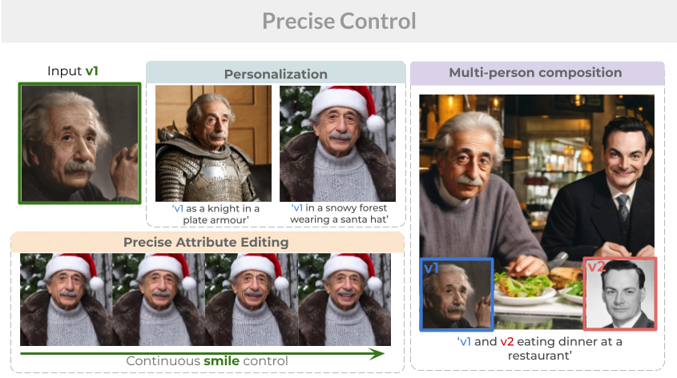

# Inserting Anybody in Diffusion Models via Celeb Basis

<a href='https://arxiv.org/abs/2306.00926'></a> &nbsp; 
<a href='https://celeb-basis.github.io'></a> &nbsp; 


<div>
<span class="author-block">
<a href="https://rishubhpar.github.io/" target="_blank">Rishubh Parihar</a><sup>1,*</sup></span>,
<span class="author-block">
  <a href="https://www.linkedin.com/in/sachidanand-v-s-449573201/?originalSubdomain=in" target="_blank">Sachidanand VS</a><sup>1,*</sup></span>,
<span class="author-block"><a href="https://scholar.google.com/citations?user=Klwb85AAAAAJ&hl=en" target="_blank">Sabarishwaran Mani</a><sup>1,2</sup></span>, <br>
  <span class="author-block">
    <a href="https://tejank10.github.io/" target="_blank">Tejan Karmali</a><sup>3</sup>,
  </span>
  <span class="author-block">
    <a href="https://scholar.google.com/citations?user=cVg7HrEAAAAJ&hl=en" target="_blank">Venkatesh Babu</a><sup>1</sup>
  </span> (*)
  </div>

  
<div class="is-size-5 publication-authors">
                  <span class="author-block">
                  <sup>1</sup> VAL IISc &nbsp;&nbsp;&nbsp;
                  <sup>2</sup> IIT Kharagpur &nbsp;&nbsp;&nbsp;
                  <sup>3</sup> Avataar.ai &nbsp;&nbsp;&nbsp;
                </div>
<br>

**TL;DR: Embedding a unique individual into the pre-trained diffusion model with:**  

✅ Single image personalization in a few minutes  
✅ Fine-grained attribute control with background preservation  
✅ Generate and interact with other (new person) concepts &nbsp;&nbsp;&nbsp;&nbsp;  
✅ Realistic composition of two faces with high quality identity preservation and selective attribute control </br>




### Updates
- **2024/07/15:** Code released!

### How It Work
<!-- 


First, we collect about 1,500 celebrity names as the initial collection. Then, we manually filter the initial one to m = 691 names, based on the synthesis quality of text-to-image diffusion model(stable-diffusion} with corresponding name prompt. Later, each filtered name is tokenized and encoded into a celeb embedding group. Finally, we conduct Principle Component Analysis to build a compact orthogonal basis.


We then personalize the model using input photo. During training~(left), we optimize the coefficients of the celeb basis with the help of a fixed face encoder. During inference~(right), we combine the learned personalized weights and shared celeb basis to generate images with the input identity.

More details can be found in our [project page](https://celeb-basis.github.io).
 -->

### Setup

Our code mainly bases on [CelebBasis](https://github.com/ygtxr1997/CelebBasis).
Additionally it uses the following repositories [Prompt-Mixing](https://github.com/orpatashnik/local-prompt-mixing) for delayed identity injection, [Lora](https://github.com/cloneofsimo/lora) for efficient finetuning and [GroundedSAM](https://github.com/IDEA-Research/Grounded-Segment-Anything) to obtain initial layout for two-person generation.
To set up our environment, please run:

```shell
conda env create -f environment.yaml
conda activate sd
python -m pip install git+https://github.com/cloneofsimo/lora.git
```  

### Pretrained weights:
- [GroundedSAM](https://github.com/IDEA-Research/Grounded-Segment-Anything)  
- [Stable Diffusion 2.1](https://huggingface.co/stabilityai/stable-diffusion-2-1-base)   
- [CosFace R100](https://github.com/deepinsight/insightface/tree/master/recognition/arcface_torch#model-zoo) for face computing Identity Loss
- [Encoder4Editing (E4E)](https://github.com/omertov/encoder4editing?tab=readme-ov-file).
- [PIPNet](https://github.com/jhb86253817/PIPNet) for face preprocessing (align and crop). PIPNet weights can be downloaded from [this link](https://github.com/ygtxr1997/CelebBasis/issues/2#issuecomment-1607775140) (provided by @justindujardin) or our [Baidu Yun Drive](https://pan.baidu.com/s/1Cgw0i723SyeLo5lbJu-b0Q) with extracting code: `ygss`. Please copy `epoch59.pth` and `FaceBoxesV2.pth` to `PreciseControl/evaluation/face_align/PIPNet/weights/`. 
- Mapper weights [wt_mapper](https://drive.google.com/drive/folders/1ScrLSa-S1Epc8fO_FBkMJvFae9EO226b?usp=sharing) and copy it under logs directory 
  
Copy the pretrained weights to './weights' folder, the directory structure is shown below: 

<!-- Old version commented out 
The pre-trained weights used in this repo include [Stable Diffusion 2.1] and 
[CosFace R100 trained on Glint360K]. 
And download FFHQ e4e weights and IR-SE50 weights from [encoder4editing](https://github.com/omertov/encoder4editing?tab=readme-ov-file).
You may copy these pre-trained weights to `./weights`, and the directory tree will be like:
 -->

```shell
PreciseControl/
  |-- weights/
      |--glint360k_cosface_r100_fp16_0.1/
          |-- backbone.pth (249MB)
      |--encoder/
          |-- e4e_ffhq_encode.pt(~1.1GB)
          |-- shape_predictor_68_face_landmarks.dat
      |-- v2-1_512-ema-pruned.ckpt (~5.0GB)
      |-- model_ir_se50.pt
      |-- sam_vit_b_01ec64.pth (for multi person)
      |-- groundingdino_swint_ogc.pth (for multi person)
      
```

### Usage

#### 0. Face Alignment

To make the Face Recognition model work as expected, 
given an image of a person, 
we first align and crop the face following [FFHQ-Dataset](https://github.com/NVlabs/ffhq-dataset).

Put your input images in `./aug_images/comparision` and run the following command with output path as `./aug_images/comparision/edited/`,
this will align & crop images the input images as per e4e requirement and save images in format required for lora finetuning. The above code also save the aligned images in `./aug_images/lora_finetune_comparision_data/` with each image in a folder structure required by dataloader for finetuning.  

```shell
bash ./00_align_face.sh ./aug_images/comparision ./aug_images/comparision/edited/
```

For example, we provide some faces in `./aug_images/comparision/`

#### 1. Personalization

The training config file is `./configs/stable-diffusion/aigc_id_for_lora.yaml`.
The most important settings are listed as follows. The id_name folder structure should be which should be taken care by above command

```shell
id_name(eg: cook)
  |-- 0000/
      |-- img.jpg
```

**Important Data Settings**
```yaml
data:
  params:
    batch_size: 2  # We use batch_size 2
    train:
      target: ldm.data.face_id.FFhq_dataset 
      params:
        root_dir: "absoulute path for the id_name folder" e.g. /data/.../id_name
        split: train
        use_aug: False
        image_size: 512
        limit_dataset_size: -1
        use_data_interpolation: False
        percentage_of_synthetic_data: 0.1
        lora_finetuning: True
        multiple_samples: True
    validation:
      target: ldm.data.face_id.FFhq_dataset
      params:
        root_dir: "absoulute path for the id_name folder" e.g. /data/.../id_name 
```

**Important Training Settings**
```yaml
lightning:
  modelcheckpoint:
    params:
      every_n_train_steps: 20
  callbacks:
    image_logger:
      target: main.ImageLogger
      params:
        batch_frequency: 50
        max_images: 8
        increase_log_steps: False

  trainer:
    benchmark: True
    max_steps: 50
    accumulate_grad_batches: 8
```

Reduce the accumulate grad batches as per the GPU availablity, but for lower value increase the max_steps appropriately.

**Training**
```shell
# bash ./01_start_lora_finetuning.sh --model weights --folder_name_to_save_output
bash ./01_start_lora_finetuning.sh "./weights/v2-1_512-ema-pruned.ckpt" "id_name"
```

Consequently, a project folder named `id_name` is generated under `./logs`. 

#### 2. Generation

Edit the prompt file `./infer_images/example_prompt_1.txt`, where `sks` denotes the first identity. To get better identity increase lora scale parameter, but this might reduce text editability.

<!-- Optionally, in `./02_start_test.sh`, you may modify the following var as you need:
```shell
step_list=(799)  # the step of trained '.pt' files, e.g. (99 199 299 399)
eval_id1_list=(0)  # the ID index of the 1st person, e.g. (0 1 2 3 4)
eval_id2_list=(1)  # the ID index of the 2nd person, e.g. (0 1 2 3 4)
``` -->

**Testing**
```shell
# bash ./02_start_test.sh sd_weights_path text_prompt_path --logs_folder_name "0 0 0 0" --is_lora_weight_used --batch_size --lora_iteration --lora_scale --image_name
bash ./02_start_test.sh "./weights/v2-1_512-ema-pruned.ckpt" "./infer_images/example_prompt_1.txt" id_name "0 0 0 0" True 4 49 0.2 image_name.jpg 
```

The generated images are under `./outputs/id_name/`.

#### 3. Attribute Edit

Edit the prompt file `./infer_images/example_prompt.txt`, where `sks` denotes the first identity. `image_name.jpg` should be present inside 
`./aug_images/comparision/edited/` or else manually you have to change the root dir in code. There are some edits available in `all_delta_w_dict.json` file. You can check the keys and pass it as attr_name. Some attr present are - `smile, beard, bang, age70, gender, eyeglasses, yellow(asian), black, eyesclose, white`. 

**Testing attr edit**
```shell
# bash ./02_start_test_pmm.sh sd_weights_path text_prompt_path --logs_folder_name "0 0 0 0" --(whether to add lora weights) --batch_size(use 1) --lora_it --lora_scale --image_name --edit_attr_name
bash ./02_start_test_pmm.sh "./weights/v2-1_512-ema-pruned.ckpt" "./infer_images/example_prompt_1.txt" id_name "0 0 0 0" True 1 49 0.2 image_name.jpg attr_name
```
This will generate a gif and list of images with different edit strength.

<!-- #### 3. (Optional) Extracting ID Coefficients

Optionally, you can extract the coefficients for each identity by running:

```shell
bash ./03_extract.sh "./weights/sd-v1-4-full-ema.ckpt" "traininYYYY-MM-DDTHH-MM-SS_celebbasis"
```

The extracted coefficients or embeddings are under `./weights/ti_id_embeddings/`. -->

### TODO
- [x] release code
- [ ] multiple person generation

### BibTex

```tex
@article{yuan2023celebbasis,
  title={Inserting Anybody in Diffusion Models via Celeb Basis},
  author={Yuan, Ge and Cun, Xiaodong and Zhang, Yong and Li, Maomao and Qi, Chenyang and Wang, Xintao and Shan, Ying and Zheng, Huicheng},
  journal={arXiv preprint arXiv:2306.00926},
  year={2023}
}
```
